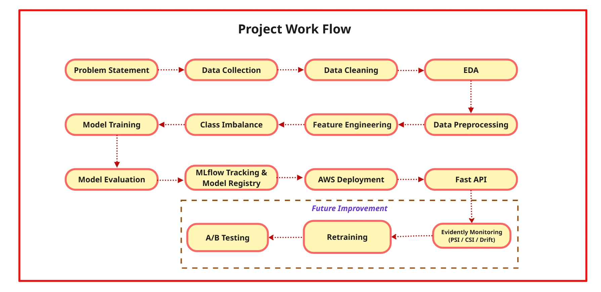
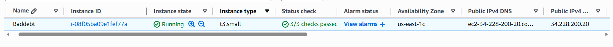
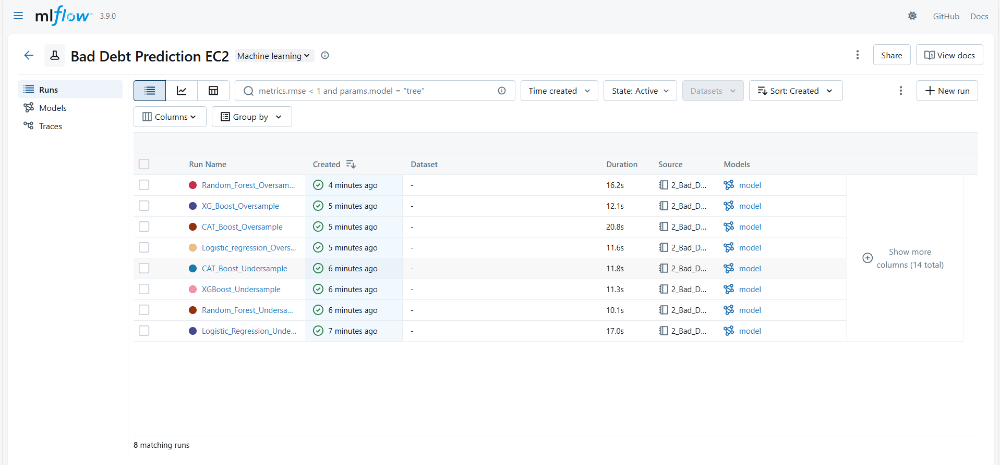
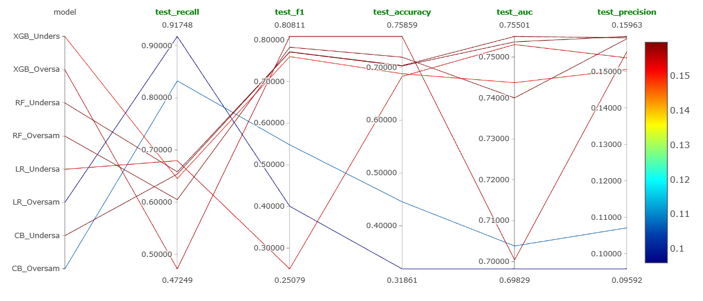
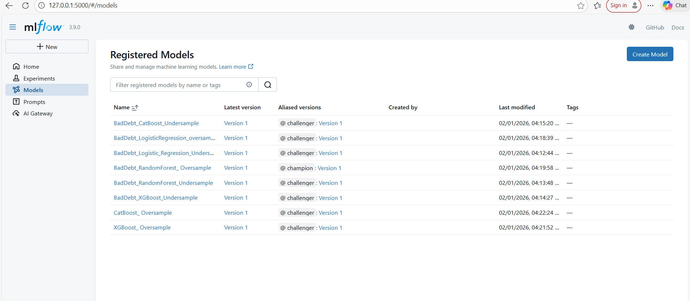

<h1 align="center">Bad Debt Prediction</h1>

  <b>Predicting high-risk borrowers to minimize bad debt and financial losses.</b>

  Designed an end-to-end machine learning pipeline with risk-based feature engineering,
  recall-optimized modeling, and drift monitoring.

<h3 align="center">Tech Stack & Deployment</h3>

  
  
  
  
  
  
  
  
  
  
  
  
  
  
  

  
  
  
  
  
  
  
  
  
  
  
  
  
  
  

---

----

## 🔎 Problem Statement

Credit Business Operating **Buy Now, Pay Later (BNPL)** faces a trade-off between **revenue growth** and **credit risk**. Approving customers without **structured risk assessment** leads to **payment defaults**, causing **bad debts** and **financial losses**. This lack of **predictive evaluation** impacts **cash flow**, **profitability**, and **risk management**.

This project builds a **machine learning classification model** to label customers as **Good (0) / Bad (1)**, enabling **data-driven credit decisions**.

----

## 📊 Data Overview

Real-world credit dataset (~100K customers, 99 features) collected under NDA, structured based on key risk dimensions:

* **Customer Behaviour**
* **Credit Behaviour**
* **Credit Bureau Data**

Includes credit bureau scores from two providers — **CR21** and **CR22** — enabling comparative analysis of their effectiveness in identifying high-risk customers.

⚠️ Dataset cannot be shared due to confidentiality constraints.

----

## ⚙️ Solution Approach

<b>1. Data Preprocessing & EDA</b>

Handled **missing values**, removed **duplicates**, and validated **financial variables** to ensure data consistency and reliability.
Performed **exploratory data analysis (EDA)** to analyse **repayment behaviour**, **delinquency trends**, and **outliers** using statistical plots and correlation analysis.

👉  **Insight:** **Credit score**, **repayment behaviour**, and **delinquency patterns** showed strong differentiation between **defaulters** and **non-defaulters**.

---

<b>2. Feature Engineering</b>

Compared **CR21** and **CR22** bureau scores using **box plots**, analysing **median separation**, **distribution spread**, and **outliers** between good and bad customers.
**CR22** showed clearer separation with reduced overlap, making it a more reliable predictor of default risk.

Applied **Weight of Evidence (WoE)** binning to transform variables into **monotonic risk-based categories**, improving interpretability and alignment with credit risk behaviour.

Performed **feature selection using Information Value (IV)**:

* **IV < 0.02** → Weak (**removed**)
* **0.02 – 0.1** → Medium
* **0.1 – 0.3** → Strong
* **> 0.3** → Very strong

Removed **highly correlated features** to avoid **multicollinearity** and improve **model stability**.

👉  **Insight:** **CR22 + WoE + IV filtering** significantly improved **class separation**, **interpretability**, and overall **model performance**.

---

<b>3. Class Imbalance Handling</b>

**To address severe class imbalance, two strategies were evaluated:**

🔹**Attempt 1: Under-Sampling**

Reduced the majority class to balance the dataset.

**Observations:**
- Loss of critical information due to removal of majority samples  
- Poor model generalisation, especially in precision  
- Overfitting observed across multiple models  
- ROC-AUC remained moderate (~0.74–0.84), but imbalance in precision-recall reduced reliability  

👉 **Conclusion:** Under-sampling failed to capture full data distribution and degraded performance.

---

🔹 **Attempt 2: SMOTE-Tomek**

Applied SMOTE for synthetic minority generation and Tomek Links for noise removal.

**Improvements:**
- Better class representation without information loss  
- Reduction in class overlap and noise  
- More consistent model performance  

**Model Comparison (Test Performance)**

| Model | Recall | Precision | AUC | Overfitting | Insight |
|------|--------|----------|-----|------------|--------|
| Logistic Regression | 0.91 | 0.09 | 0.69 | Yes | High recall but excessive false positives |
| CatBoost | 0.82 | 0.10 | 0.70 | Yes | Strong recall but unstable |
| XGBoost | 0.47 | 0.15 | 0.70 | No | Stable but lower detection |
| **Random Forest** | **0.61** | **0.16** | **0.74** | **No** | ✅ Best trade-off between detection and stability |

👉 **Final Choice:** SMOTE-Tomek retained as the optimal resampling strategy  

👉 **Decision Logic:** Prioritised a model that balances **risk detection (high recall)** with **stability and generalisation**, rather than maximising accuracy  

👉 **Insight:** Enabled reliable identification of **high-risk customers** while maintaining **robust and consistent model performance**

---

<b>4. Model Selection</b>

Evaluated multiple models to identify the most reliable performer on balanced data.

**Final Model:** Random Forest — selected for its consistent performance and ability to generalise well without overfitting.

👉 **Insight:** Ensemble tree-based models effectively capture complex, non-linear relationships, leading to stable predictions on unseen data.

---

<b>5. Model Evaluation</b>

Evaluated using key **credit risk metrics**:

* **ROC-AUC (0.74)** → Good class discrimination
* **Gini (0.48)** → Moderate predictive power
* **KS (34%)** → Strong separation
* **Recall (60%)** → Majority of defaulters identified

Maintained consistent performance across **train**, **test**, and **OOT datasets**.
Threshold tuning (e.g., **0.3**) used to prioritise **risk detection**.

👉  **Insight:** Model is optimised for **high recall**, ensuring early detection of **risky customers**.

---

<b>6. Performance Analysis</b>

Focused on **classification errors** and **feature contribution**.
Special attention on **False Negatives**, as they represent the highest **financial risk**.
Used **feature importance** to identify key drivers of default.

👉 **Insight:** Strong **risk separation** and clear **driver identification** validate model reliability.

---

<b>7. PSI & CSI Monitoring</b>

Used **PSI** and **CSI** with **Out-of-Time (OOT) validation** to track data drift and ensure model stability.

* **PSI (0.39)** → Significant shift in data distribution
* **CSI (Stable)** → Feature importance remains consistent

Currently, drift is monitored using **PSI and CSI with OOT validation**; future enhancements will extend this to **real-time production monitoring** using tools like **Evidently AI**.

👉  **Insight:** Indicates **concept drift**, requiring **monitoring**, **recalibration**, and **periodic retraining**.

---

## 📈 Business Impact

* Achieved **60% recall** on high-risk customers, identifying **3 out of 5 defaulters** before credit approval
* Reduced potential bad-debt exposure from **₹1M to ~₹0.4M** through model-driven risk decisions *(scenario-based estimate)*
* Prioritised **KS (34%)**, **Gini (0.48)**, and **Recall** over accuracy, aligning with real-world **credit risk cost considerations**
* Implemented **PSI/CSI monitoring** to detect data drift, enabling **proactive recalibration** and sustained model performance

---

## 🧰 Tech Stack

* **Programming & Libraries:** Python, Pandas, NumPy
* **Machine Learning:** Scikit-learn, XGBoost, CatBoost, Random Forest
* **Experiment Tracking & Deployment:** MLflow, AWS SageMaker, Streamlit
* **Monitoring & Risk Analytics:** PSI, CSI
* **Feature Engineering & Techniques:** WoE, Information Value (IV), SMOTE-Tomek, OOT Validation
* **Evaluation Techniques:** KS Statistic, Gini Coefficient, ROC-AUC, with prioritisation of Recall to ensure effective detection of high-risk customers

----

## ⚡ Challenges

- **Severe class imbalance** — bad customers were a tiny minority, requiring careful resampling strategy selection and metric prioritisation
- **Misleading accuracy** — shifted evaluation entirely toward recall, KS, and Gini to reflect true business risk
- **Feature selection complexity** — noisy, correlated, and leakage-prone variables addressed using WoE/IV filtering and stability checks
- **Recall vs precision trade-off** — SMOTE-Tomek improved bad customer detection but increased overfitting risk in some models, requiring careful validation

---

##  🚀 Future Improvements

* Integrate **Evidently AI** for automated monitoring of **data drift, model performance, and data quality** in production.
  *(Currently, drift is monitored using **PSI and CSI with OOT validation**; future work will extend this to real-time production data.)*

* Implement **A/B testing** to compare multiple models in real-world scenarios and select the best-performing model based on **business metrics**

* Introduce a **dynamic decision threshold** based on **business risk appetite**, replacing a fixed cutoff

* Build a **feedback loop** using actual repayment/default outcomes to continuously improve model performance over time

---

## 🔬 Experiment Tracking & Model Lifecycle (MLflow on AWS)

### 🔹 MLflow Tracking Server (AWS EC2)

Deployed an **MLflow Tracking Server on AWS EC2** to centrally log experiments, parameters, metrics, and artifacts.

---

### 🔹 Experiment Run Tracking

Tracked multiple model runs with **parameters and performance metrics**, enabling reproducible comparison and model selection.

---

### 🔹 Model Registry

Registered and versioned models using **MLflow Model Registry** for structured lifecycle management and deployment readiness.

-------------------

## 🌐 **Deployment**
