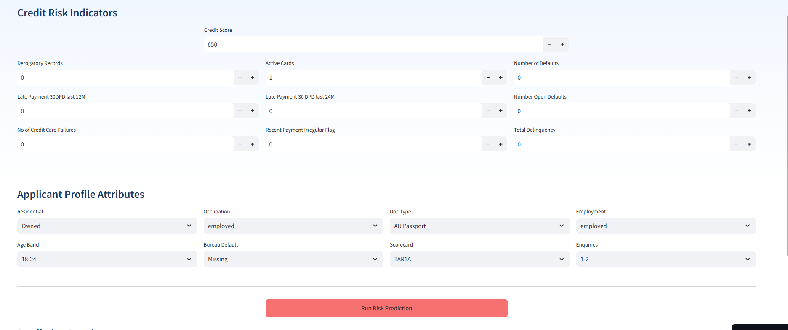

<h1 align="center">Bad Debt Prediction</h1>

<p align="center">
  <b>End-to-end machine learning system for predicting credit risk in BNPL environments
Designed to identify high-risk borrowers and reduce bad debt exposure
Enables data-driven, risk-aware lending decisions at scale</b>
</p>


<p align="center">
  
  
  
  
  
  
  
  
</p>


---
## 🚀 Key Highlights

- Developed an end-to-end **Bad Debt Prediction system** for BNPL lending to identify high-risk borrowers
- Achieved **60% recall** for early detection of high-risk borrowers
- Demonstrated potential reduction in bad-debt exposure through model-driven credit decision simulation
- Enabled risk-based lending decisions by identifying high-risk applicants for rejection or stricter terms,fast-tracking low-risk customers 
- Applied WoE-IV feature engineering and SMOTE-Tomek resampling to improve interpretability and detection of high-risk customers  
- Selected **Random Forest** for its robustness and optimal balance between recall, precision, and generalisation  
- Evaluated model performance using **KS (34%)**, **Gini (0.48)**, and **ROC-AUC**, aligned with industry credit risk standards  
- Implemented **PSI (0.39), CSI monitoring, and OOT validation** to detect data drift and ensure model stability  
- Designed a scalable real-time inference pipeline using **AWS SageMaker, FastAPI, and Streamlit**, with **MLflow on AWS EC2** for experiment tracking and model lifecycle management
  
-----------------


----

## 🔎 Problem Statement

Credit Business Operating **Buy Now, Pay Later (BNPL)** faces a trade-off between **revenue growth** and **credit risk**. Approving customers without **structured risk assessment** leads to **payment defaults**, causing **bad debts** and **financial losses**. This lack of **predictive evaluation** impacts **cash flow**, **profitability**, and **risk management**.

This project builds a **machine learning classification model** to label customers as **Good (0) / Bad (1)**, enabling **data-driven credit decisions**.

<details>
<summary><b> 👉 Baseline (Manual Credit Policy Simulation)</b></summary>

Before ML, credit decisions relied on manual rules using factors like credit score and past defaults, often resulting in higher bad debt due to limited and rigid risk assessment.

To simulate this, a simple rule-based model was created:

- Reject if credit score < 600  
- Reject if past defaults ≥ 2  
- Approve otherwise  

### ⚠️ Limitations
- Fixed rules lack flexibility  
- Cannot capture complex relationships  
- May misclassify risky or safe customers  

</details>

----

Here’s a **documentation-ready version** (clean, slightly more formal, GitHub-friendly):

---

## 💹 Business Impact & Decision Framework

> This model enhances credit approval decisions by focusing on **early identification of high-risk customers**, enabling proactive risk mitigation and reducing potential financial losses.


#### Business Impact

* Achieved **60% recall**, identifying **3 out of 5 defaulters before approval**, improving early risk detection
* Reduced simulated bad-debt exposure from **₹1M → ₹0.4M (~60% reduction)** using model-driven decision policies


#### Why This Approach Works

* **High Recall Focus:** Missing a defaulter (false negative) leads to **direct financial loss**, so the model prioritizes detecting risky applicants
* **ML over Rule-Based:** Traditional methods rely on limited variables, while ML leverages **multi-feature relationships** to capture complex risk patterns
* **Optimized Threshold (~0.3):** Lower than the default (0.5) to **increase recall**, ensuring fewer high-risk customers are missed


#### Business Trade-Off & Cost Logic

* Accepts a **controlled increase in false positives** (manual review effort)
* Minimizes **false negatives**, which carry significantly higher financial impact

| Error Type     | Business Impact                |
| -------------- | ------------------------------ |
| False Negative | High financial loss (critical) |
| False Positive | Lower cost (review / delay)    |

➡️ Strategy prioritizes **minimizing high-cost errors over overall accuracy**


#### Decision Enablement

* **High-risk customers** → Reject or approve with stricter terms (higher interest, lower limits)
* **Low-risk customers** → Fast-track approvals with better offers, improving customer experience


#### Model Reliability

* **KS Score:** 34%
* **Gini Coefficient:** 0.48
* **ROC-AUC:** Strong discriminatory performance

✔️ Metrics align with **industry standards for credit risk modeling**
✔️ Ensures **reliable, scalable, and data-driven decision-making**


> The model is designed to **reduce bad debt by prioritizing early detection of high-risk customers**, accepting minor operational costs to avoid significant financial losses.


-----

## 📊 Data Overview

Real-world credit dataset (~100K customers, 99 features) collected under NDA, structured based on key risk dimensions:

* **Customer Behaviour**
* **Credit Behaviour**
* **Credit Bureau Data**

Includes credit bureau scores from two providers — **CR21** and **CR22** — enabling comparative analysis of their effectiveness in identifying high-risk customers.

⚠️ Dataset cannot be shared due to confidentiality constraints.

----

## ⚙️ Model Development & Validation

<details>
<summary><b>1. Data Preprocessing & EDA</b></summary>

Handled **missing values**, removed **duplicates**, and validated **financial variables** to ensure data consistency and reliability.
Performed **exploratory data analysis (EDA)** to analyse **repayment behaviour**, **delinquency trends**, and **outliers** using statistical plots and correlation analysis.

👉  **Insight:** **Credit score**, **repayment behaviour**, and **delinquency patterns** showed strong differentiation between **defaulters** and **non-defaulters**.

</details>

---

<details>
<summary><b>2. Feature Engineering</b></summary>

Compared **CR21** and **CR22** bureau scores using **box plots**, analysing **median separation**, **distribution spread**, and **outliers** between good and bad customers.
**CR22** showed clearer separation with reduced overlap, making it a more reliable predictor of default risk.

Applied **Weight of Evidence (WoE)** binning to transform variables into **monotonic risk-based categories**, improving interpretability and alignment with credit risk behaviour.

Performed **feature selection using Information Value (IV)**:

* **IV < 0.02** → Weak (**removed**)
* **0.02 – 0.1** → Medium
* **0.1 – 0.3** → Strong
* **> 0.3** → Very strong

Removed **highly correlated features** to avoid **multicollinearity** and improve **model stability**.

👉  **Insight:** **CR22 + WoE + IV filtering** significantly improved **class separation**, **interpretability**, and overall **model performance**.

</details>

---


<details>
<summary><b>3. Class Imbalance Handling</b></summary>


**To address severe class imbalance, two strategies were evaluated:**


🔹**Attempt 1: Under-Sampling**

Reduced the majority class to balance the dataset.

**Observations:**
- Loss of critical information due to removal of majority samples  
- Poor model generalisation, especially in precision  
- Overfitting observed across multiple models  
- ROC-AUC remained moderate (~0.74–0.84), but imbalance in precision-recall reduced reliability  

👉 **Conclusion:** Under-sampling failed to capture full data distribution and degraded performance.

---

🔹 **Attempt 2: SMOTE-Tomek**

Applied SMOTE for synthetic minority generation and Tomek Links for noise removal.

**Improvements:**
- Better class representation without information loss  
- Reduction in class overlap and noise  
- More consistent model performance  

**Model Comparison (Test Performance)**

| Model | Recall | Precision | AUC | Overfitting | Insight |
|------|--------|----------|-----|------------|--------|
| Logistic Regression | 0.91 | 0.09 | 0.69 | Yes | High recall but excessive false positives |
| CatBoost | 0.82 | 0.10 | 0.70 | Yes | Strong recall but unstable |
| XGBoost | 0.47 | 0.15 | 0.70 | No | Stable but lower detection |
| **Random Forest** | **0.61** | **0.16** | **0.74** | **No** | ✅ Best trade-off between detection and stability |


👉 **Final Choice:** SMOTE-Tomek retained as the optimal resampling strategy  

👉 **Decision Logic:** Prioritised a model that balances **risk detection (high recall)** with **stability and generalisation**, rather than maximising accuracy  

👉 **Insight:** Enabled reliable identification of **high-risk customers** while maintaining **robust and consistent model performance**

</details>

---

<details>
<summary><b>4. Model Selection</b></summary>

Evaluated multiple models to identify the most reliable performer on balanced data.

**Final Model:** Random Forest — selected for its consistent performance and ability to generalise well without overfitting.

👉 **Insight:** Ensemble tree-based models effectively capture complex, non-linear relationships, leading to stable predictions on unseen data.

</details>

---

<details>
<summary><b>5. Model Evaluation</b></summary>

Evaluated using key **credit risk metrics**:

* **ROC-AUC (0.74)** → Good class discrimination
* **Gini (0.48)** → Moderate predictive power
* **KS (34%)** → Strong separation
* **Recall (60%)** → Majority of defaulters identified

Maintained consistent performance across **train**, **test**, and **OOT datasets**.
Threshold tuning (e.g., **0.3**) used to prioritise **risk detection**.

Accuracy was not used as the primary metric due to class imbalance. Business risk is better captured through Recall, KS, and Gini.

**Precision is intentionally lower due to recall prioritization. In credit risk, false positives lead to additional manual review costs, whereas false negatives result in direct financial loss. The model is therefore optimized to minimize high-cost errors (false negatives).**

👉  **Insight:** Model is optimised for **high recall**, ensuring early detection of **risky customers**.

</details>

---

<details>
<summary><b>6. Performance Analysis</b></summary>

Focused on **classification errors** and **feature contribution**.
Special attention on **False Negatives**, as they represent the highest **financial risk**.
Used **feature importance** to identify key drivers of default.

👉 **Insight:** Strong **risk separation** and clear **driver identification** validate model reliability.

</details>

---

<details>
<summary><b>7. PSI & CSI Monitoring</b></summary>


Used **PSI** and **CSI** with **Out-of-Time (OOT) validation** to track data drift and ensure model stability.

* PSI (0.39) → Significant shift in data distribution
* CSI (Stable) → Feature importance remains consistent


Currently, drift is monitored using **PSI and CSI with OOT validation**; future enhancements will extend this to **real-time production monitoring** using tools like **Evidently AI**.

👉  **Insight:** **The high PSI value indicates significant data drift, suggesting that the model may degrade over time. This requires periodic retraining, monitoring, and recalibration before full-scale production deployment.**

</details>

---


## 🧰 Tech Stack

* **Programming & Libraries:** Python, Pandas, NumPy
* **Machine Learning:** Scikit-learn, XGBoost, CatBoost, Random Forest
* **Experiment Tracking & Deployment:** MLflow, AWS SageMaker, Streamlit
* **Monitoring & Risk Analytics:** PSI, CSI
* **Feature Engineering & Techniques:** WoE, Information Value (IV), SMOTE-Tomek, OOT Validation
* **Evaluation Techniques:** KS Statistic, Gini Coefficient, ROC-AUC, with prioritisation of Recall to ensure effective detection of high-risk customers

---------

## 🌩️ Deployment

### SageMaker Deployment (Design & Implementation)

Designed and validated a scalable deployment pipeline using AWS SageMaker for real-time inference.

* Uploaded trained model artifacts to Amazon S3
* Developed a custom inference script for prediction handling
* Configured and deployed a real-time SageMaker endpoint using the SDK
* Successfully tested end-to-end inference using the SageMaker runtime client

**Note:** Designed and validated a scalable deployment pipeline using AWS SageMaker; endpoint tested but not kept live due to cost constraints.

----------

## 🔄 MLOps Pipeline & Lifecycle

This system is designed with an end-to-end ML lifecycle, with deployment and monitoring components implemented and retraining strategy defined for production scalability.

#### Pipeline Overview:
1. Data Ingestion → Raw credit data collected and validated  
2. Data Processing → Feature engineering (WoE, IV)  
3. Model Training → Multiple models evaluated using MLflow  
4. Model Selection → Best model registered in MLflow Model Registry  
5. Deployment → Model deployed via AWS SageMaker endpoint (tested)  
6. Monitoring → PSI/CSI with OOT validation used to detect data drift  

#### 🔁 Retraining Strategy (Planned)

- PSI > 0.2 → Warning  
- PSI > 0.3 → Retraining required  

Retraining pipeline is designed to:
- Re-train model on updated data  
- Validate using KS, Gini  
- Register new version in MLflow  
- Deploy updated model  

(Current implementation includes monitoring; retraining automation is planned.)

#### Model Versioning

- Experiments tracked using MLflow  
- Best model versioned in Model Registry  
- Ensures reproducibility and version control
  
---

## 🏗️ System Architecture

```text id="f9t2b8"
User
  ↓
Streamlit App (UI & Input Handling)
  ↓
SageMaker Endpoint (Real-time Inference)
  ↓
Prediction Response → Returned to UI

Amazon S3 → Model Storage & Versioning
```

---

### Architecture Overview

This architecture enables scalable real-time predictions by separating key components:

* **Application Layer (Streamlit on EC2):** Handles user interaction
* **Backend Layer (FastAPI):** Validates and processes requests
* **Model Layer (SageMaker):** Serves the model via real-time endpoint
* **Storage Layer (S3):** Stores model artifacts and supports versioning

**Predictions are generated in real time and returned to the UI for display.**

-------

### **Streamlit UI**




-----------


## ⚡ Challenges

- **Severe class imbalance** — bad customers were a tiny minority, requiring careful resampling strategy selection and metric prioritisation
- **Misleading accuracy** — shifted evaluation entirely toward recall, KS, and Gini to reflect true business risk
- **Feature selection complexity** — noisy, correlated, and leakage-prone variables addressed using WoE/IV filtering and stability checks
- **Recall vs precision trade-off** — SMOTE-Tomek improved bad customer detection but increased overfitting risk in some models, requiring careful validation

---

##  🚀 Future Improvements

* Implement automated retraining pipelines triggered by drift thresholds (PSI-based alerts)
  
  *(Currently, drift is monitored using **PSI and CSI with OOT validation**; future work will extend this to real-time production data.)*

* Implement **A/B testing** to compare multiple models in real-world scenarios and select the best-performing model based on **business metrics**

* Introduce a **dynamic decision threshold** based on **business risk appetite**, replacing a fixed cutoff

* Build a **feedback loop** using actual repayment/default outcomes to continuously improve model performance over time


---

## 🔬 Experiment Tracking & Model Registry (MLflow on AWS)


#### 🔹 MLflow Tracking Server (AWS EC2)
Deployed an MLflow Tracking Server on AWS EC2 to log experiments, parameters, metrics, and artifacts.


---

#### 🔹 Experiment Run Tracking
Tracked multiple model runs with parameters and performance metrics, enabling reproducible comparison and model selection.


---

#### 🔹 Model Registry
Registered and versioned models using MLflow Model Registry for structured model management and version control.


-------------------

**Author:** Sree Varshan  
**Open to ML engineering / Data Scientist/ Credit Risk Analyst opportunities**  

-----
