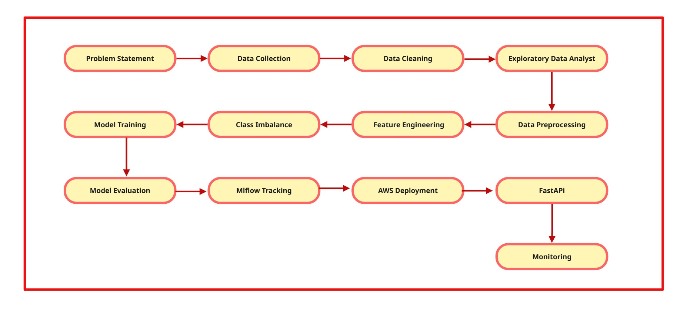

<h1 align="center">Bad Debt Prediction</h1>

  Detecting High-Risk Borrowers Preventing Bad Debt and Financial Losses

  
  
  
  
  
  
  
  
  
  

---

----

## Problem Statement

Credit Business Operating **Buy Now, Pay Later (BNPL)** faces a trade-off between **revenue growth** and **credit risk**. Approving customers without **structured risk assessment** leads to **payment defaults**, causing **bad debts** and **financial losses**. This lack of **predictive evaluation** impacts **cash flow**, **profitability**, and **risk management**.

This project builds a **machine learning classification model** to label customers as **Good (0) / Bad (1)**, enabling **data-driven credit decisions**.

----

## Data Overview

Real-world credit dataset (~100K customers, 99 features) collected under NDA, structured based on key risk dimensions:

* **Customer Behaviour**
* **Credit Behaviour**
* **Credit Bureau Data**

Includes credit bureau scores from two providers — **CR21** and **CR22** — enabling comparative analysis of their effectiveness in identifying high-risk customers.

⚠️ Dataset cannot be shared due to confidentiality constraints.

----

## Solution Approach

<b>1. Data Preprocessing & EDA</b>

Handled **missing values**, removed **duplicates**, and validated **financial variables** to ensure data consistency and reliability.
Performed **exploratory data analysis (EDA)** to analyse **repayment behaviour**, **delinquency trends**, and **outliers** using statistical plots and correlation analysis.

**Insight:** **Credit score**, **repayment behaviour**, and **delinquency patterns** showed strong differentiation between **defaulters** and **non-defaulters**.

---

<b>2. Feature Engineering</b>

Compared **CR21** and **CR22** bureau scores using **box plots**, analysing **median separation**, **distribution spread**, and **outliers** between good and bad customers.
**CR22** showed clearer separation with reduced overlap, making it a more reliable predictor of default risk.

Applied **Weight of Evidence (WoE)** binning to transform variables into **monotonic risk-based categories**, improving interpretability and alignment with credit risk behaviour.

Performed **feature selection using Information Value (IV)**:

* **IV < 0.02** → Weak (**removed**)
* **0.02 – 0.1** → Medium
* **0.1 – 0.3** → Strong
* **> 0.3** → Very strong

Removed **highly correlated features** to avoid **multicollinearity** and improve **model stability**.

**Insight:** **CR22 + WoE + IV filtering** significantly improved **class separation**, **interpretability**, and overall **model performance**.

---

<b>3. Class Imbalance Handling</b>

Initial **under-sampling** led to **information loss**.
Implemented **SMOTE-Tomek** to balance the dataset using **synthetic sampling + noise removal**.

**Insight:** Improved detection of **defaulters**, increasing **recall** and reducing **missed high-risk customers**.

---

<b>4. Model Selection</b>

Trained multiple models: **Logistic Regression**, **Random Forest**, **XGBoost**, and **CatBoost**.
Evaluated based on **generalisation**, **recall**, and ability to detect **high-risk customers**.

**Final Model:** **Random Forest** (best balance of **recall + stability**)

**Insight:** **Ensemble models** captured complex patterns while maintaining **robust performance**.

---

<b>5. Model Evaluation</b>

Evaluated using key **credit risk metrics**:

* **ROC-AUC (0.74)** → Good class discrimination
* **Gini (0.48)** → Moderate predictive power
* **KS (34%)** → Strong separation
* **Recall (60%)** → Majority of defaulters identified

Maintained consistent performance across **train**, **test**, and **OOT datasets**.
Threshold tuning (e.g., **0.3**) used to prioritise **risk detection**.

**Insight:** Model is optimised for **high recall**, ensuring early detection of **risky customers**.

---

<b>6. Performance Analysis</b>

Focused on **classification errors** and **feature contribution**.
Special attention on **False Negatives**, as they represent the highest **financial risk**.
Used **feature importance** to identify key drivers of default.

**Insight:** Strong **risk separation** and clear **driver identification** validate model reliability.

---

<b>7. PSI & CSI Monitoring</b>

Used **PSI** and **CSI** along with **Out-of-Time (OOT) testing** to monitor model stability.

* **PSI (0.39)** → Significant **data drift**
* **CSI (Stable)** → Consistent feature importance

**Insight:** Indicates **concept drift**, requiring **monitoring**, **recalibration**, and **periodic retraining**.

---

## Business Impact

- Achieved **60% recall** on bad customers, catching 3 in 5 defaulters before credit approval — reducing reactive collections and financial exposure
- Demonstrated potential to reduce bad-debt exposure from **₹1M to ~₹0.4M** through model-driven risk decisioning (scenario-based estimate based on recall performance)
- Prioritised **KS (34%), Gini (0.48), and Recall** over accuracy, reflecting the true business cost of approving a high-risk customer
- Implemented **PSI/CSI monitoring** to detect shifts in customer behaviour and feature distributions, enabling timely recalibration before model performance degrades

---
## 🔹 Tech Stack

* **Programming:** Python
* **Machine Learning:** Scikit-learn, XGBoost, CatBoost
* **Data Processing & Analysis:** Pandas, NumPy
* **Model Tracking & Deployment:** MLflow, AWS SageMaker, Streamlit
* **Monitoring & Risk Analytics:** WoE/IV, PSI, CSI
  
----

## 🔹 Challenges

- **Severe class imbalance** — bad customers were a tiny minority, requiring careful resampling strategy selection and metric prioritisation
- **Misleading accuracy** — shifted evaluation entirely toward recall, KS, and Gini to reflect true business risk
- **Feature selection complexity** — noisy, correlated, and leakage-prone variables addressed using WoE/IV filtering and stability checks
- **Recall vs precision trade-off** — SMOTE-Tomek improved bad customer detection but increased overfitting risk in some models, requiring careful validation

---

## 🔹 Future Improvements

* Integrate **Evidently AI** for automated monitoring of data drift, model performance, and data quality in production.

* Implement **A/B testing** to compare multiple models in real-world scenarios and select the best-performing model based on business metrics.

* Introduce a **dynamic decision threshold** based on business risk appetite instead of a fixed cutoff.

* Build a **feedback loop from actual repayment/default outcomes** to continuously improve model performance over time.

---

## 👉 **Proof of Work - Detailed Section**

#### 🔹 **Experiment Tracking & Model Lifecycle Setup (AWS MLflow)**

- **MLflow Tracking Server on AWS EC2**

MLflow tracking server hosted on AWS EC2 to log experiments, metrics, and artifacts centrally.

 

------------------

-  **Experiment Run Tracking**

 Multiple model runs tracked with parameters and performance metrics to enable reproducible model comparison.
 

------------------------------------------
 

-----------------------------

- **Model Registry**

------------

## 🔹**Deployment**
